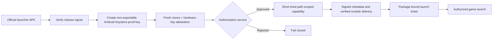

<div align="center">
  

  # Jester Mods Launcher

  **Transparency source for the official signed Android game-mod launcher.**

  [](#compatibility) [](#technology) [](#execution-flavors) [](SOURCE_AVAILABLE.md)

  [](https://youtube.com/@jestermods3.0) [](https://ko-fi.com/jestermods) [](https://github.com/BenigJester/Jester-Mods-Launcher/security/advisories/new)

  [Overview](#overview) · [Features](#features) · [Authenticity](#verify-an-official-apk) · [Build](#build-from-source) · [Security](#security-model) · [Privacy](#privacy-and-permissions)
</div>

---

> [!IMPORTANT]
> This is a **source-available transparency repository**, not an open-source distribution grant. Review [SOURCE_AVAILABLE.md](SOURCE_AVAILABLE.md) before copying, redistributing, rebranding, or publishing modified code or binaries.

## Overview

Jester Mods Launcher provides a single library for discovering supported games, installing verified modules, applying the appropriate Root or Non-root execution path, launching configured games, and managing updates.

This repository exists so users and security researchers can inspect the Android client's trust boundaries: network access, signed metadata, module integrity, launcher updates, device-bound access, and guarded launch authorization.

| | Details |
|---|---|
| **Publisher** | [JesterMODS](https://youtube.com/@jestermods3.0) |
| **Application ID** | Root: `com.moodtools.hub.root` · Non-root: `com.moodtools.hub.nonroot` |
| **Android target** | API 35 |
| **Root ABI** | `arm64-v8a` |
| **Non-root ABIs** | `arm64-v8a`, `armeabi-v7a` |
| **UI** | Kotlin + Jetpack Compose |
| **Native runtime** | C++ / JNI via CMake |
| **Build toolchain** | Gradle, JDK 17, Android SDK/NDK |

## Features

### Launcher experience

- [x] Unified game library with installed-state and compatibility detection
- [x] Browseable signed module catalog
- [x] Game, launcher, and module update workflows
- [x] Per-module changelog and launcher release history
- [x] Verified direct downloads and Google Play handoff where configured
- [x] Batch updates for installed modules
- [x] Repair and removal flows with explicit user confirmation
- [x] First-run language selection and localized launcher content
- [x] Smart cleanup for cached download artifacts

### Integrity and access

| Layer | Protection |
|---|---|
| **Launcher identity** | Official Root and Non-root APKs share a published signing-certificate fingerprint. |
| **Update metadata** | Launcher releases, catalogs, manifests, and module files are checked against signed metadata. |
| **Module delivery** | Protected downloads require fresh proof plus hardware-backed Android key attestation. |
| **Download integrity** | Artifacts are accepted only after their signed identity and expected digest are verified. |
| **Direct launch** | Patched games require a fresh package-bound, time-bound, nonce-bearing launch ticket. |
| **Release packaging** | Production builds fail closed unless the external keystore matches the configured trusted fingerprint. |

> [!NOTE]
> Production game modules, native targets, service code, signing keys, credentials, offsets, dumps, and operational material are intentionally excluded. The repository includes a neutral [`modules/com.example.module/`](modules/com.example.module/) template for architecture review.

## Execution flavors

| Flavor | Architecture | Runtime path | Intended environment |
|---|---|---|---|
| **Root** | `arm64-v8a` | Root execution bridge and native injector runtime | Rooted Android devices |
| **Non-root** | `arm64-v8a`, `armeabi-v7a` | Guarded compatibility, identity-shell, or supported direct-patch path | Devices without root access |

> [!WARNING]
> Some Non-root package-replacement flows change the game's signer. Android may erase the original app's local data during the first signer-changing replacement. Read each in-app confirmation before continuing.

## Verify an official APK

Official Root and Non-root APKs use this signing-certificate SHA-256 fingerprint:

```text
AA65ABF5EB089BFD92E3138A9BFA0D6BA8E0F875FF0B26E295AF656D67CCDA29
```

Verify a downloaded APK with Android SDK Build Tools:

```powershell
apksigner verify --verbose --print-certs .\Jester-Mods.apk
Get-FileHash .\Jester-Mods.apk -Algorithm SHA256
```

> [!CAUTION]
> Do not install an APK if its signer differs from the fingerprint above. The signing fingerprint proves publisher identity; also compare the APK's file hash with the SHA-256 published for that specific release and flavor.

<details>
<summary><strong>Why are locally built APKs different?</strong></summary>

Debug APKs use a local debug certificate. They are intentionally unable to use the protected production module channel, even when compiled from this repository. The official private signing key is never included here.

</details>

## Security model



The service binds access to the official package, release signer, device proof key, and access grant. Software-only attestation, revoked chains, mismatched packages or signers, stale capabilities, missing proofs, and replayed nonces are rejected.

> [!NOTE]
> These controls protect server delivery and make unauthorized direct launching harder; they do not claim unbreakable DRM on a device fully controlled by its owner. See the complete [security policy](SECURITY.md).

<details>
<summary><strong>Direct-patch authorization boundary</strong></summary>

The launcher creates a separate non-exportable key for guarded direct launches. A patched game receives only the public key and loads its module after verifying a fresh ticket bound to the target package, time window, and nonce. Publishing the verifier does not disclose either private key.

</details>

<details>
<summary><strong>Public source versus production service</strong></summary>

| Publicly reviewable | Kept private |
|---|---|
| Launcher UI and client trust logic | Production signing keys |
| Catalog and update verification | Authorization-service source |
| Root / Non-root execution bridges | Operational credentials |
| Module integrity checks | Production game modules and payloads |
| Neutral module template | Reverse-engineering work material |

A fork has a different signer and cannot receive protected production payloads from the service.

</details>

## Build from source

### Requirements

- JDK 17 or newer
- Android SDK Platform 35
- Android NDK
- CMake 3.22.1
- Ninja
- PowerShell on Windows

Build both debug flavors:

```powershell
.\gradlew.bat :app:assembleRootDebug :app:assembleNonrootDebug --no-daemon
```

The APKs are written below `app\build\outputs\apk\`. Debug builds are locally signed and cannot use the production module channel.

### Operator and test helpers

Run the interactive project manager:

```powershell
.\standalone-tools.cmd
```

Or use the direct build/install/device-test helper:

```powershell
.\test_helper.cmd
```

See [`scripts/README.md`](scripts/README.md) for embedded local-test modules, allowlisted private builds, guided device checks, and focused compatibility verification.

> [!WARNING]
> Production packaging requires an external release keystore and its matching trusted certificate fingerprint. The Gradle configuration refuses to create a production package when the required identity is absent or mismatched.

<details>
<summary><strong>Repository layout</strong></summary>

```text
.
├── app/
│   └── src/
│       ├── main/        # Shared Compose UI, catalog, updates, and trust logic
│       ├── root/        # Root execution bridge and runtime
│       └── nonroot/     # Non-root compatibility and guarded patch manager
├── identity-shell-template/
├── modules/
│   └── com.example.module/
├── scripts/             # Build, test, export, and verification helpers
├── third_party/         # Vendored components with separate license notices
├── build.gradle
├── settings.gradle
└── standalone-tools.cmd
```

</details>

## Technology

| Area | Stack |
|---|---|
| **Application** | Kotlin 2.0.21, Java 17 |
| **Interface** | Jetpack Compose + Material 3 |
| **State and async work** | Android Lifecycle + Kotlin Coroutines |
| **Native layer** | C++, JNI, CMake, Ninja |
| **APK verification** | Android `apksig` |
| **Build** | Android Gradle Plugin 9.0.1 |
| **Testing** | JUnit, AndroidX Test, Espresso, Compose UI Test |

## Compatibility

| Requirement | Root | Non-root |
|---|---:|---:|
| Android device | Required | Required |
| Root access | Required | Not required |
| `arm64-v8a` | Supported | Supported |
| `armeabi-v7a` | Not packaged | Supported |
| Official production service from a local build | Not available | Not available |

Compatibility also depends on each catalog module's declared package, version, ABI, and execution method.

## Privacy and permissions

The launcher does not require a conventional username/password account. It uses network access for signed metadata, access verification, updates, and protected module delivery.

| Permission / data | Purpose |
|---|---|
| Internet | Catalog, access, changelog, update, and module delivery |
| Package visibility | Discover supported installed games and launcher activities |
| Package installation | Install confirmed launcher, game, or supported patched-package updates |
| Package deletion | Complete explicit Non-root replacement and migration flows |
| Android Keystore proof | Bind protected access and launch authorization to an installation |
| Local app storage | Cache leases, catalogs, downloads, module artifacts, and library state |

Private proof keys remain non-exportable in Android Keystore. Game save files are not uploaded as part of the access or module-delivery protocol. Review the complete [privacy and data inventory](PRIVACY.md).

## Troubleshooting

<details>
<summary><strong>A local build cannot download production modules</strong></summary>

This is expected. A locally compiled APK has a different signing identity, and the production service accepts only the official package and release signer with valid device-bound proof.

</details>

<details>
<summary><strong>Gradle cannot find the SDK or NDK</strong></summary>

Install Android SDK Platform 35, the Android NDK, CMake 3.22.1, and Ninja through Android Studio's SDK Manager. Ensure your machine-local `local.properties` points to the Android SDK; it is intentionally excluded from Git.

</details>

<details>
<summary><strong>The wrong APK replaced my installed launcher</strong></summary>

Debug packages use an application ID suffix so they can sit beside production builds. Confirm the selected flavor and build type before installing, then verify its package and signer with `apksigner`.

</details>

<details>
<summary><strong>I found a security issue</strong></summary>

Open a [private GitHub Security Advisory](https://github.com/BenigJester/Jester-Mods-Launcher/security/advisories/new). Include the affected flavor, version/build, APK and signer hashes, affected component, reproduction steps, and expected versus observed behavior. Remove credentials, private payloads, identifiers, and user data.

</details>

## Project documents

| Document | Purpose |
|---|---|
| [Security policy](SECURITY.md) | Supported release, authenticity, threat boundaries, and private reporting |
| [Privacy notice](PRIVACY.md) | Service data, local storage, and reporting hygiene |
| [Source-available notice](SOURCE_AVAILABLE.md) | Rights, restrictions, and excluded production material |
| [Third-party notices](THIRD_PARTY_NOTICES.md) | Attribution and dependency license references |
| [Operator scripts](scripts/README.md) | Build, packaging, embedded-test, and device-test workflows |

## Reporting concerns

Use a private GitHub Security Advisory for vulnerabilities. For authenticity concerns, include the APK SHA-256, signer fingerprint, download URL, launcher flavor, and version/build. Never post active digital keys, recovery identifiers, device identifiers, certificate chains, private module payloads, or unreleased module details in a public issue.

## Credits

Created and maintained by **[JesterMODS](https://youtube.com/@jestermods3.0)**.

Enjoying the project? [Buy JesterMODS a coffee on Ko-fi](https://ko-fi.com/jestermods).

Third-party components remain governed by their own licenses. See [THIRD_PARTY_NOTICES.md](THIRD_PARTY_NOTICES.md) and [`THIRD_PARTY_LICENSES/`](THIRD_PARTY_LICENSES/).

<div align="center">

  [](https://youtube.com/@jestermods3.0) [](https://ko-fi.com/jestermods)

  <sub>Official binaries are identified by their release signing certificate—not by filename, mirror, or visual appearance.</sub>
</div>
# Trigger build
